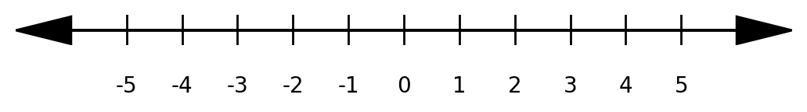

# number-line

A simple number line generator to show simple inequalities.



To create the python virtual environment:

```bash
cd scripts
./create_venv.sh  # Linux

# or

call create_venv.bat  # Windows
```

To create a number line:

```bash
./number_line.py
```
